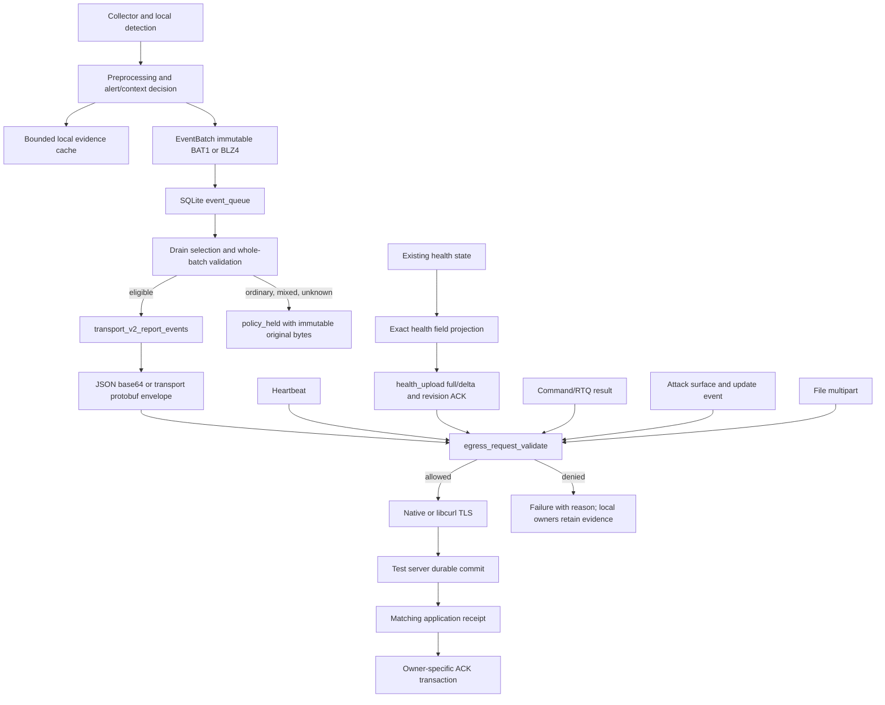

# Minimal egress v1: authoritative purposes and request boundaries

This policy is a development change, not a production rollout or existing-queue migration. The current investigation baseline is `7c43dc2d30f9c05292ca5cce6dfe893d2dc39528` on `codex/release-workflow-convergence`; historical evidence is from `03d78b39b2c4f180b6acf41390e45946a2996b53` / `win_3.2.589`. Historical offline decoding proves enqueue only, not HTTP delivery or server acceptance. Tests below use synthetic data and a loopback test receiver.

Default data purposes are proven alerts, heartbeat, and explicitly projected health. The human owner additionally authorized minimum authentication/bootstrap/startup/signed-policy/command-receipt/protocol-ACK controls, separately from the three data purposes. This authorization does not permit command/query results, host inventory, attachments, or free-text diagnostics. There is no environment switch that widens egress purposes.

## Actual outbound execution graph



The primary production choke point is `src/transport/ingest_http.c:native_request_ex`, before libcurl HTTP/2, libcurl HTTP/1.1, or native socket transmission. The public arbitrary JSON suffix API reaches this same boundary. `request_to_suffix_ex` returns a local policy refusal without route failover or server-health penalties. Independent paths receive the same request policy:

| Owner and path | Transmission boundary |
| --- | --- |
| `storage/queue_sqlite.c` drain → `transport/transport_v2.c:edr_transport_v2_report_events` → `edr_ingest_http_post_report_events` | Both persisted bytes and final JSON/protobuf request envelope are validated. Retry, reopen, old batches, and mixed batches receive the same rule. |
| `core/agent.c:edr_agent_poll_heartbeat` → `edr_ingest_http_post_heartbeat` → `post_to_suffix` | `native_request_ex`, including the heartbeat helper that bypasses `request_to_suffix`. |
| `core/agent.c:edr_agent_poll_engine_health` → `edr_ingest_http_post_engine_health_json` | Projection before health full/delta construction; final full/delta request uses the same whitelist. |
| Command executor / durable result outbox → `edr_transport_v2_command_result_typed` | Final native request guard; policy rejection is nonretryable and cannot become a command-result ACK. |
| Command upload outbox / forensic attachment → `edr_transport_v2_upload_file_for_command` → multipart upload | Guard before file open and before the native/libcurl multipart split. No attachment bytes are sent. |
| `attack_surface/attack_surface_report.c:edr_attack_surface_execute_impl` | Public JSON suffix API → final native guard. |
| `command/agent_update_event.c` durable upgrade-event owner | Public JSON suffix API → final native guard. |
| Route discovery, hello, poll, config status, control ACK | Exact route and request schema, including final native guard. |
| Native control stream `stream_connect_once`; libcurl stream loops | Same GET purpose/query validation before connecting or creating a transfer. |
| `native_get_to_file` policy/rule/bootstrap downloads | Exact control route/query validation before native network I/O. |
| `core/agent_update.c:update_http_get` / `update_download_file` | Direct libcurl guard; automatic redirects disabled so another route cannot bypass validation. |
| `forensic/deep_collector.c:dc_download` native plus subprocess curl fallback | Guard before either path. Redirect following and the existing insecure TLS escape are refused. Local detection and already installed collector execution remain enabled. |
| `installer_worker/headless_uninstaller_win.c:edr_native_attest` | Separate executable uses the same policy library before WinHTTP. Only the existing exact uninstall-control attestation schema is allowed. |

An additional source search for socket/connect/sendto, OpenSSL writes/handshakes, libcurl transfers, WinHTTP/WinInet and subprocess curl found the native paths above. `collector_linux.c:proc_send_mcast_op` uses `PF_NETLINK` / `NETLINK_CONNECTOR` to subscribe to local kernel process events; it is not a server egress socket. The installer bootstrap packaging/scripts, updater-launched installation script and arbitrary operator-authored external collector programs are distinct executors; this policy is not a sandbox for arbitrary child-program networking. Native Windows execution of the finalizer and Schannel branches must be separately verified before release.

## Purpose contracts

Sizes below are request-body or decoded-payload bounds, not TLS/header bytes. Existing communication budgets, queue capacity admission, retry backoff, and cancellation still apply; tests do not disable them.

| Purpose | Admission and allowed fields | Size | Frequency/aggregation and dedup | Confirmation |
| --- | --- | --- | --- | --- |
| Alerts and necessary context | Every frame has validated detection provenance, triggering evidence, matching event/process identity and supported protobuf fields. Priority, score, `emit_alert`, `p0_rule`, and mere protobuf presence never establish identity. Valid loopback alerts are permitted. The existing encoder retains the associated actor, command, path, event-specific facts and captured detection context for the real alert. | Decoded batch ≤ 4 MiB; frame ≤ 256 KiB; ≤ 4096 frames; final envelope ≤ 8 MiB. BLZ4 is bounded before decompression. Outer zstd content size must be known and bounded. | Existing detection suppression/governor and EventBatch limits remain; queue delivery uses bounded backoff and immutable identity. Mixed batches are indivisible. Server dedup uses endpoint, batch ID and exact payload SHA-256. | `code=OK`, accepted complete response, ACK v1 durable/processed state, exact endpoint ID, batch ID and SHA-256, no invalid frames. Only then may SQLite perform the existing ACK transaction. |
| Heartbeat | Exact nonempty `endpoint_id`, `agent_version`, `policy_version`; bounded identifier characters; no extra fields. | 1024 bytes. | Existing heartbeat scheduler defaults to 60 seconds; no event-derived heartbeat content or event replay. | Existing heartbeat HTTP success updates heartbeat transport state only; never confirms an event batch or local evidence. |
| Health and diagnostic summaries | Exact path/type whitelist described below; full local raw diagnostic detail stays in its existing owner. No process path, username, command text, URL, raw record, free-text errors, or unrecognized block. | Projected full/delta ≤ 32 KiB; producer input ≤ 128 KiB; depth ≤ 10. Exact nonnegative integers below 2^53 avoid cJSON rounding. | Existing configured health interval and expiry apply. Existing v1 revision protocol sends changed top-level blocks, requires a periodic full checkpoint at 900 seconds, and resynchronizes once on base mismatch. No rejected event is renamed as health. | Existing `accepted=true` and v1 revision ACK; delta requires matching supported revision semantics. Its ACK belongs only to the health revision. |
| Command and RTQ results | Default denied, even when commands are authentic and execution succeeds. Command delivery receipt remains a separate allowed control message. Result and artifact owners retain their durable state and observable policy cause. | 0 transmitted bytes. | No network retry for locally rejected command results; terminal rejection is not server success. Local outbox capacity remains enforced. | None. A local refusal must not create result ACK or artifact success. |
| Attack-surface inventory | Default denied; `endpoints/<id>/attack-surface` is not a health/control exception. Local collectors remain enabled. | 0 transmitted bytes. | Existing collection scheduling continues; upload fails with a cause. | None; no fake upload success. |
| File/forensic attachment | Default denied before native or libcurl multipart body creation/transmission. Command/upload IDs do not grant data-purpose authorization. | 0 transmitted bytes. | Existing bounded upload outbox retains artifact identity/retry/terminal state. | None; no server key or ACK is manufactured. |
| Upgrade logs/events | Default denied through the JSON suffix guard; upgrade maintenance control downloads remain distinct. | 0 transmitted bytes. | Existing local durable upgrade-event owner is preserved. | None. |
| Historical/replay batches | Same whole-payload rule as current batches. Ordinary, mixed, source-only remote v2, legacy encoding, unknown versions, and unavailable compression decoding stay local with reason and immutable original identity. | Existing bounded queue budget includes retained rows; unsupported input is never sent. | `policy_held` prevents endless network retries; distinct from successful ACK. Explicit compatibility review is required to reprocess. | No local retention or derived health summary acknowledges the original payload. |

The v1 health whitelist in `egress_request_policy.c:health_fields` is authoritative. It retains timestamp; recovery activity/mode/counts; communication success/failure and control-ACK counts; resource pressure/budgets; rule readiness/version/hash; source-only unhealthy/loss/retry state; local evidence/queue capacity, effective-capacity-defaulting and held counts; process-association misses; file-binding/gate durability, retry, pause and recovery counters; sensor visibility; detector enablement/readiness; PMFE queue/result counts; known capability names with code/build/policy/runtime flags; and existing health-upload counters. Unsupported capability names and details are omitted. Known exact reason codes reuse `p0_source_only_contract.h` and a closed set of actual durable-owner/collector/recovery/provenance causes. Process-generation unavailability, unresolved canonical file paths, rules-not-ready and legacy ACK compatibility pending remain distinguishable. Other free-text reasons become `detail_available_locally`; the complete underlying diagnosis remains local. Identifiers are typed bounded tokens and runtime status is a closed enumeration. Arbitrary objects, arrays, nulls, duplicate keys, trailing bytes, raw NULs and decoded NUL key/value suffixes are refused at send time.

## Alert field boundaries and remaining minimization work

`egress_batch_policy.c:schema_known` permits only the checked-in `BehaviorEvent`, `BehaviorAlert` and nested detail/feed/context protobuf descriptors. It refuses duplicate/unknown fields recursively, overlong strings, invalid nested encoding and unsupported event purposes before validating actual detection source, evidence and identity. Current fields that can be retained for an accepted alert are listed below; sizes refer to `event.options` / generated `event.pb.h` storage bounds, including the terminating NUL for strings. Each entire encoded frame remains limited to 256 KiB.

| Field group | Current permitted facts and bounds |
| --- | --- |
| Event and detector identity | Event/endpoint IDs 48; tenant ID 64; event type/time, pid/ppid/session, priority and process-chain depth. Priority alone cannot authorize the frame. |
| Actor and user identity | Process name 256, executable path 4096, hash 65, complete command 98302; effective/creator username, domain and SID 256 each, logon IDs 64, identity source/quality 32. |
| Generation and completeness | Start key and creation FILETIME; generation source 64; raw/canonical image paths 4096 each; namespace/resolution/source/completeness labels 32; evidence revision; parent creation time 64; named truncation list 512; parent name 256/path 512. |
| Process detail/context | Parent/grandparent identity, integrity 64, captured creation time 64, elevation/PIDs, current directory 4096. Legacy parent command 8192; authoritative optional `ProcessContext.parent_cmdline` 98302. Absence is not enriched from another process generation. |
| File/network/registry/DNS/script detail | File operation32/path4096/size/MOTW; network endpoints64/ports/protocol16/auxiliary path4096; registry key1024/name512/value8192/operation32; DNS query512; script snippet4096. The single protobuf detail variant follows the actual source event. |
| Detection explanation | `ave_result_json`4096, at most eight MITRE IDs16; embedded alert score, 14 tactic probabilities, triggered tactics512, time/pid/ppid, process name256/path1024/command1024, `related_iocs_json`4090 and `user_subject_json`4090, subject status16/withheld reason64. JSON is parsed structurally to verify the supported detector source and matching triggering basis. |
| Existing typed AVE feed | Target path4096/IP64/domain512/hash65; typed risk scores, port, IOC hits, PMFE/PE/tunnel indicators, behavior flags and event type. Positive fields do not replace detector provenance validation. |

This implementation proves purpose admission and preserves a real alert's existing explanation. It does not yet prove that every retained actor/user/parent field, typed AVE feed field or every additional member of bounded detection-explanation JSON is necessary for every individual rule. Accepted JSON context is not a complete per-rule field projection. Defining narrower explanation contracts requires auditing current detector and server consumers with real rule fixtures; blindly clipping these fields would risk losing evidence. This remains an explicit residual requirement before claiming strict alert-field minimization complete. Unsupported old mixed batches may contain a valid alert but are held intact; extracting it needs new batch identity, parent-payload lineage and a reviewed compatible ACK protocol, not local modification under its original batch ID.

## Minimum control protocol (separate authorization)

Authentication uses the existing TLS/mTLS identity, configured authorization and request-signing headers. No secret, signing material, environment, or arbitrary payload is added to health. The policy does not weaken CA trust, signed-policy verification, command signatures/nonces/expiry/replay checks, or durable ACK ownership.

| Control | Permitted protocol content |
| --- | --- |
| Signed-policy sync | GET exact `agent/runtime-policy.toml`, `agent/rules.toml`, `agent/p0-bundle.enc`, `agent/sensor-interest.json`, with no extra query/body. Existing signature/version validation after download is unchanged. |
| Routing/startup | GET `agent/comms-route-profile`, query only endpoint/tenant IDs. GET `agent/version/latest` and `agent/download/<bounded-version-token>`. |
| Local collector bootstrap | GET exact forensic-collector manifest/download routes, query only known `kind`, `os`, `arch` values. This is an inbound startup dependency; it grants no collector result or attachment egress. Arbitrary external download routes remain denied. |
| Control hello | POST `ingest/control/hello`: `client_hello`, endpoint/agent/policy IDs, h2/zstd booleans, dictionary/schema/profile IDs, bounded arrays of supported schemas/dictionaries/profiles, exact capability booleans/IDs. No inventory or command output. ≤ 8 KiB. |
| Control stream | GET `ingest/control/stream`: endpoint/agent/policy IDs, dictionary/schema/profile IDs, h2/zstd flags. No raw data or unknown query fields; duplicate parameters denied. |
| Long poll | GET `ingest/poll-commands`: same relevant IDs/flags plus fixed limit 8 and wait 1–30 seconds. Existing reconnect backoff/cancellation/lease behavior remains. |
| Command receipt | POST `ingest/control/ack`: endpoint/command ID, bounded status/reason enumeration, known transport, nonnegative sequence. No result/detail field. ≤ 8 KiB. Existing durable retry record is removed only by `acked=true`. |
| Signed-policy status | POST `ingest/config-status`: existing identity/hash/sequence/nonce/signature/key IDs, verified flag, desired version/hash, bounded apply status and restart flag, fixed source and verified marker. Free-text rejection becomes a fixed failure code. ≤ 8 KiB. |
| Uninstall completion | POST exact `agent/lifecycle/uninstall-attest`: existing schema, task/endpoint IDs, three successful completion flags, exact timestamp. ≤ 8 KiB. Existing lifecycle capability authentication, bounded attempts and cleanup remain. No logs/artifacts. |

An unrecognized route, field, method, codec, version or purpose is denied. Alternate configured paths, external signed artifact URLs, historical dictionary-compressed envelopes whose dictionary cannot be loaded by the validator, and new capability names require an explicit reviewed compatibility extension. Fresh report-event envelopes use the existing identity codec when an outbound zstd dictionary is loaded, preserving the immutable decoded batch and normal server codec semantics. Dictionary-free bounded zstd remains supported. This avoids making a valid alert unsendable because the final validator cannot inspect an optional dictionary codec; it does not reinterpret or change persisted historical batch bytes.

## Repeatable verification and limits

`tests/test_egress_request_policy.c` tests the real policy: field names/real values, unknown channels, health projection/redaction/required recovery summaries, exact cause preservation, removal-only health deltas, allocation failure without a partial summary, wrong types, duplicate keys, trailing bytes, embedded/escaped NULs, closed control queries and control receipt isolation. `tests/test_egress_batch_policy.c` tests the real encoder and batch decoder, alerts/context, ordinary/mixed/BLZ4/legacy/unknown inputs and identity validation. `deep_collector_manifest` retains its successful approved bootstrap, atomic replacement, content hash, refresh interval and manifest-origin fallback checks; it also proves an unapproved external route is rejected before native I/O and before a harmless subprocess curl marker can execute.

Run the isolated transport check with:

```sh
python3 -B tests/test_egress_tls_receiver.py --client /absolute/build/tests/test_egress_tls_client
```

It generates short-lived CA/server/client certificates in a temporary directory, binds only 127.0.0.1, requires mTLS, exercises the production SQLite queue/codec/HTTPS sender, reopens the queue after lost ACK, verifies duplicate identity/payload, deliberately mismatches an ACK, merges health full/delta under a separately acknowledged revision, and rejects independent data-channel bypasses. A receiver SQLite FULL commit precedes each permitted receipt. Positive cases cover DNS identity, IP SAN identity, and protobuf envelopes with an outbound dictionary configured. Wrong CA and wrong SAN tests must produce zero HTTP requests. The report separates synthetic collection/detection/enqueue counters, observed requests/body bytes, durable receiver state, duplicates and client assertions. No production service is contacted and no existing queue is read or migrated.

The native OpenSSL path previously set SNI and validated the CA chain without setting the expected hostname/IP identity. Both native ordinary requests and native control-stream connections now configure the appropriate peer identity before the handshake. The same test against the exact starting `7c43dc2` sources accepted a wrong-SAN heartbeat; the corrected sender produces zero HTTP requests for it. Existing CA validation remains enabled in all cases.

The final isolated native matrix passed using a synthetic event fed into the actual `AVE_FeedEventEx` and behavior-monitor callback, followed by the production combined encoder, SQLite queue, HTTPS sender and receipt owner. The receiver independently checks actual callback provenance (owner, matched predicate, threshold, captured event count/type, PID/time and command) rather than trusting the client decision. The detector observes one input and one alert callback; collected=2 is explicitly labeled `synthetic_fixture`. DNS and IP-SAN cases each send eight requests / 12,229 body bytes; protobuf with configured dictionary sends eight / 9,844. The ordinary batch is 191 bytes and the actual alert batch 1,564. Each has zero business failures or client assertion failures, three durable batch identities and two exact duplicate observations. Wrong CA/SAN remain zero requests. Test-local AVE state is confined to the disposable receiver directory by the child working directory.

The unchanged final callback client also compiled and ran against the exact starting archive. DNS/IP each failed nine client checks and thirteen receiver business checks: fourteen requests / 86,912 and 86,918 bytes respectively. Its actual AVE callback still fired once but the encoded 1,298-byte alert lacks the new owner-level evaluation basis, so the receiver cannot confirm its provenance and returns a business rejection; zero durable batches are committed. The ordinary 191-byte event and denied independent channels still reach the old sender. This comparison establishes the repaired detector-explanation-to-receipt contract; it is not an equal-alert-byte comparison or proof that the historical detector did not trigger. Protobuf/dictionary baseline similarly fails but is not a compatibility proof for historical compressed envelopes. Wrong-SAN baseline again sends one 94-byte heartbeat; wrong CA sends none.

Earlier fixed-provenance sender-boundary experiment: the same initial C client and Python receiver copied into a disposable `git archive` of `7c43dc2` built and failed as expected. Its results below record the earlier 618-byte alert fixture, before switching the checked-in client to the actual AVE callback. It provided an equal-payload before/after transport comparison; the checked-in repeatable test now gives stronger detector-to-receipt evidence. Counts exclude TLS/headers; fixture collection counters are not an on-host collector run.

| Scenario | Before (starting HEAD) | After | Result |
| --- | --- | --- | --- |
| DNS HTTPS + queue reopen, duplicate, mismatched ACK, health full/delta and independent channels | 16 requests, 83,092 body bytes, 10 receiver business failures, 6 client assertions failed | 8 requests, 5,909 body bytes, zero receiver failures, zero failed assertions | Regression failed before; passed after |
| IP SAN HTTPS, same fixture | 16 requests, 83,098 body bytes, 10 receiver failures, 6 client assertions failed | 8 requests, 5,909 body bytes, zero receiver failures/assertions | Regression failed before; passed after |
| Protobuf envelope with configured outbound dictionary | 14 requests, 80,211 body bytes; receiver cannot decode the historical dictionary codec | 8 requests, 5,114 body bytes; valid identity envelopes and exact alert preserved | Passed after; baseline is not a codec compatibility proof |
| Untrusted CA | Zero HTTP requests | Zero HTTP requests | Passed both |
| Wrong server SAN | One heartbeat request, 94 body bytes | Zero HTTP requests | Regression failed before; passed after |

In the earlier fixed fixture, the ordinary loopback record is 191 bytes and the valid alert is 618 bytes in both builds. In all passing DNS/IP/protobuf runs, the receiver has three durable batch identities and two exact duplicate observations. Only two distinct batch IDs receive a valid queue-owned ACK (`tls-alert` and `tls-ack-lost`); the third is a direct deliberate wrong-hash receipt that the client rejects. Two duplicate observations do not represent two additional distinct ACKed batches. The held ordinary row remains in SQLite; reopening the queue after a lost alert receipt allows an exact resend and a genuine receipt. Only the valid alert carries the synthetic necessary command/context marker. The baseline also sends raw health, a command result, an attachment, inventory, an upgrade event and an unknown channel; each is independently rejected by the test receiver rather than counted as successful business reception.

The same client can be compiled against historical sources and run with `--baseline`; regression failures and disallowed requests remain a failed test rather than being relabeled as a pass. Host C tests, loopback native OpenSSL/mTLS integration, Windows native collectors/finalizer/Schannel, real rule production, and historical onsite fixtures are different evidence levels. Windows/on-site execution and protocol-compatible extraction of alerts from held legacy mixed batches are not established by these tests. Do not declare all strict minimization requirements complete while such paths remain unverified.
