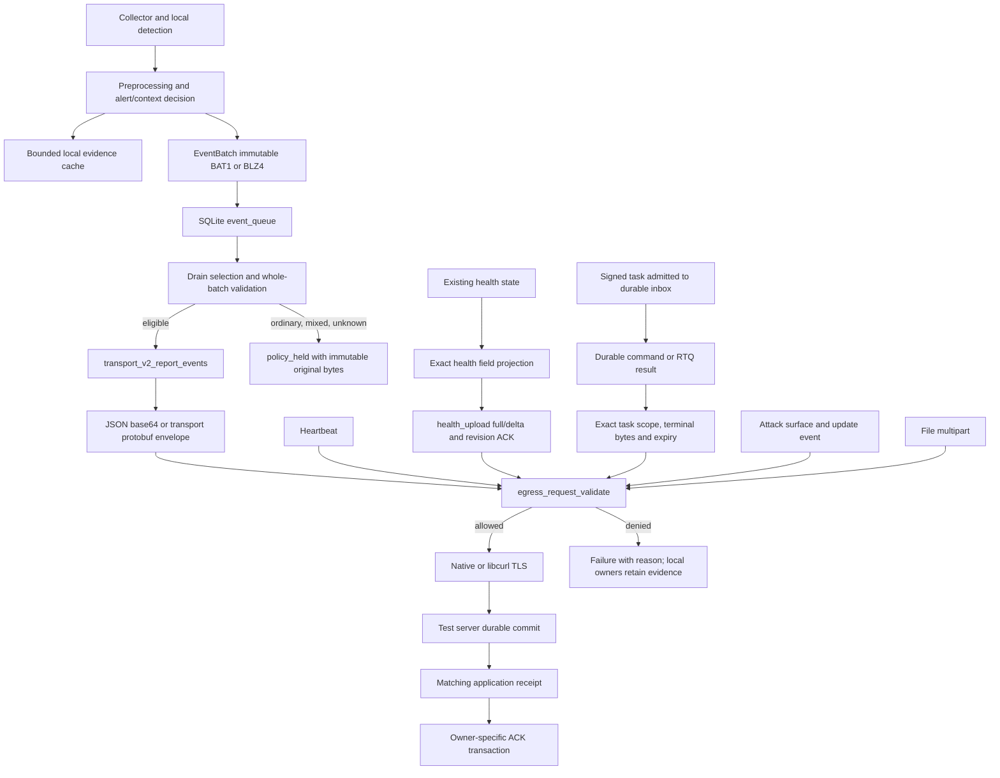

# Minimal egress v2: authoritative purposes and request boundaries

This policy is a development change, not a production rollout or existing-queue migration. The original investigation baseline is `7c43dc2d30f9c05292ca5cce6dfe893d2dc39528`; the blocker-resolution baseline is `8fed2f9ae7dc018804e56d4ca747078727d41156` on `codex/release-workflow-convergence`; historical evidence is from `03d78b39b2c4f180b6acf41390e45946a2996b53` / `win_3.2.589`. Historical offline decoding proves enqueue only, not HTTP delivery or server acceptance. Tests below use synthetic data and a loopback test receiver.

Default data purposes are proven alerts, heartbeat, and explicitly projected health. The human owner additionally authorized minimum authentication/bootstrap/startup/signed-policy/command-receipt/protocol-ACK controls, separately from the three data purposes. The October 7 RTR/RTQ correction additionally authorizes bounded results of verified remote tasks. Host inventory without a task, attachments, and free-text diagnostics remain denied. There is no environment switch that widens egress purposes.

Control ACKs preserve the existing CommandEnvelope transport value. The closed
set is `https_control`, `https_control_stream`, `https_long_poll`,
`https_h2_server_stream`, `https_http1_stream`, `https_h2_long_poll`,
`https_http1_long_poll`, and `https_transport_v2`. The latter five are existing
server producer values, including durable retries; they grant no additional
fields or data purposes. Unknown values and command-result fields remain denied.

Health reports `minimal-egress-v2` and `egress.task_results_supported=true`.
The server rejects result-dependent dispatch for v1 and explicit/missing v2 support,
including periodic containment probes; recovery/cancel commands retain their existing
safety exemptions. Artifact upload is advertised as disabled. File-dependent
capabilities declare that dependency; this correction does not authorize multipart.
The filename is retained for existing documentation links. Version v1 is historical.

## Actual outbound execution graph



The primary production choke point is `src/transport/ingest_http.c:native_request_ex`, before libcurl HTTP/2, libcurl HTTP/1.1, or native socket transmission. The public arbitrary JSON suffix API reaches this same boundary. `request_to_suffix_ex` returns a local policy refusal without route failover or server-health penalties. Independent paths receive the same request policy:

| Owner and path | Transmission boundary |
| --- | --- |
| `storage/queue_sqlite.c` drain → `transport/transport_v2.c:edr_transport_v2_report_events` → `edr_ingest_http_post_report_events` | Both persisted bytes and final JSON/protobuf request envelope are validated. Retry, reopen, old batches, and mixed batches receive the same rule. |
| `core/agent.c:edr_agent_poll_heartbeat` → `edr_ingest_http_post_heartbeat` → `post_to_suffix` | `native_request_ex`, including the heartbeat helper that bypasses `request_to_suffix`. |
| `core/agent.c:edr_agent_poll_engine_health` → `edr_ingest_http_post_engine_health_json` | Projection before health full/delta construction; final full/delta request uses the same whitelist. |
| Command executor / durable result outbox → `edr_transport_v2_command_result_typed` | Final native request guard; policy rejection is nonretryable and cannot become a command-result ACK. |
| Command upload outbox / forensic attachment → `edr_transport_v2_upload_file_for_command` → multipart upload | Guard before file open and before the native/libcurl multipart split. No attachment bytes are sent. |
| `attack_surface/attack_surface_report.c:edr_attack_surface_execute_impl` | Public JSON suffix API → final native guard. |
| `command/agent_update_event.c` durable upgrade-event owner | Public JSON suffix API → final native guard. |
| Route discovery, hello, poll, config status, control ACK | Exact route and request schema, including final native guard. |
| Native control stream `stream_connect_once`; libcurl stream loops | Same GET purpose/query validation before connecting or creating a transfer. |
| `native_get_to_file` policy/rule/bootstrap downloads | Exact control route/query validation before native network I/O. |
| `core/agent_update.c:update_http_get` / `update_download_file` | Direct libcurl guard; automatic redirects disabled so another route cannot bypass validation. |
| `forensic/deep_collector.c:dc_download` native plus subprocess curl fallback | Guard before either path. Redirect following and the existing insecure TLS escape are refused. Local detection and installed collector execution remain enabled. Every blocking/spawn/legacy entry validates a closed local argument contract before resolving or downloading a binary: query mode, local request/output paths, bounded limit/PID and full collection. Upload/frontend/remote-config/unknown arguments and legacy upload URLs are rejected; quoted local paths remain supported. |
| `installer_worker/headless_uninstaller_win.c:edr_native_attest` | Separate executable uses the same policy library before WinHTTP. Only the existing exact uninstall-control attestation schema is allowed. |

An additional source search for socket/connect/sendto, OpenSSL, libcurl,
WinHTTP/WinInet and subprocess curl found the native paths above.
`collector_linux.c:proc_send_mcast_op` uses local kernel NETLINK_CONNECTOR.
Installer Python/PowerShell enrollment uses a fixed seven-field control object
(token, hostname, OS, architecture, version, empty IP and CSR), with no event,
command result or diagnostic attachment. PowerShell's connectivity probe is
bodyless HEAD. WPF `MainWindow.xaml.cs` probes fixed health/readiness/enroll
routes (empty enrollment object); its `PostAsync` function posts to the local
WebView UI. Signed bootstrap-manifest retrieval is an inbound trust dependency.
These existing installer protocols were inspected in source, not run on Windows.
Their trust/enrollment/rollback behavior is preserved. Packaging/signing and
operator smoke scripts are development executors rather than agent data exits.
The local collector contract does not sandbox an arbitrary substituted program
or operator-authored VQL against all OS networking; native endpoint verification
remains necessary before a whole-endpoint claim.

## Purpose contracts

Sizes below are request-body or decoded-payload bounds, not TLS/header bytes. Existing communication budgets, queue capacity admission, retry backoff, and cancellation still apply; tests do not disable them.

| Purpose | Admission and allowed fields | Size | Frequency/aggregation and dedup | Confirmation |
| --- | --- | --- | --- | --- |
| Alerts and necessary context | Every frame has validated detection provenance, triggering evidence, matching event/process identity and supported protobuf fields. Priority, score, `emit_alert`, `p0_rule`, and mere protobuf presence never establish identity. Valid loopback alerts are permitted. The existing encoder retains the associated actor, command, path, event-specific facts and captured detection context for the real alert. | Decoded batch ≤ 4 MiB; frame ≤ 256 KiB; ≤ 4096 frames; final envelope ≤ 8 MiB. BLZ4 is bounded before decompression. Outer zstd content size must be known and bounded. | Existing detection suppression/governor and EventBatch limits remain; queue delivery uses bounded backoff and immutable identity. Original mixed batches remain immutable; explicit offline recovery may create a new projected identity with retained parent-hash lineage. Server dedup uses endpoint, batch ID and exact payload SHA-256. | `code=OK`, accepted complete response, ACK v1 durable/processed state, exact endpoint ID, batch ID and SHA-256, no invalid frames. Only then may SQLite perform the existing ACK transaction. |
| Heartbeat | Exact nonempty `endpoint_id`, `agent_version`, `policy_version`; bounded identifier characters; no extra fields. | 1024 bytes. | Existing heartbeat scheduler defaults to 60 seconds; no event-derived heartbeat content or event replay. | Existing heartbeat HTTP success updates heartbeat transport state only; never confirms an event batch or local evidence. |
| Health and diagnostic summaries | Exact path/type whitelist described below; full local raw diagnostic detail stays in its existing owner. No process path, username, command text, URL, raw record, free-text errors, or unrecognized block. | Projected full/delta ≤ 32 KiB; producer input ≤ 128 KiB; depth ≤ 10. Exact nonnegative integers below 2^53 avoid cJSON rounding. | Existing configured health interval and expiry apply. Existing v1 revision protocol sends changed top-level blocks, requires a periodic full checkpoint at 900 seconds, and resynchronizes once on base mismatch. No rejected event is renamed as health. | Existing `accepted=true` and v1 revision ACK; delta requires matching supported revision semantics. Its ACK belongs only to the health revision. |
| Command and RTQ results | A remote command passes existing signature verification; deadline/payload rejection returns only its failure result. Its local authorization binds original command/type, tenant, endpoint and a fixed 24h delivery expiry from issue time. Final egress must match the pending durable terminal status, exit code, detail and correlation. Shell chunks inherit the opening session authority and match its session/sequence; an ID prefix alone grants nothing. | Existing detail limit <16 KiB, JSON envelope ≤128 KiB; shell chunk ≤2 KiB. No authority fields on wire. | Existing durable retries and backoff; expiry/missing ownership is a local terminal refusal, never an ACK. Old rejected results receive no retrospective authority or replay. Execution deadlines are unchanged. | Existing accepted complete application ACK after server persistence; only then mark the durable terminal reported. |
| Attack-surface inventory | Default denied; `endpoints/<id>/attack-surface` is not a health/control exception. Local collectors remain enabled. | 0 transmitted bytes. | Existing collection scheduling continues; upload fails with a cause. | None; no fake upload success. |
| File/forensic attachment | Default denied before native or libcurl multipart body creation/transmission. Command/upload IDs do not grant data-purpose authorization. | 0 transmitted bytes. | Existing bounded upload outbox retains artifact identity/retry/terminal state. | None; no server key or ACK is manufactured. |
| Upgrade logs/events | Default denied through the JSON suffix guard; upgrade maintenance control downloads remain distinct. | 0 transmitted bytes. | Existing local durable upgrade-event owner is preserved. | None. |
| Historical/replay batches | Same whole-payload rule as current batches. Ordinary, mixed, source-only remote v2, legacy encoding, unknown versions, and unavailable compression decoding stay local with reason and immutable original identity. | Existing bounded queue budget includes retained rows; unsupported input is never sent. | `policy_held` prevents endless network retries; distinct from successful ACK. The stopped-agent `--queue-recover-v1` check/apply tool requires exact owner tuple, scoped inventory SHA and new projected batch identity; no automatic production migration runs. | No local retention or derived health summary acknowledges the original payload. |

The health whitelist in `egress_request_policy.c:health_fields` is authoritative. It retains timestamp; recovery activity/mode/counts; communication success/failure and control-ACK counts; resource pressure/budgets; rule readiness/version/hash; source-only unhealthy/loss/retry state; local evidence/queue capacity, effective-capacity-defaulting and held counts; process-association misses; file-binding/gate durability, retry, pause and recovery counters; sensor visibility; detector enablement/readiness; PMFE queue/result counts; known capability names with code/build/policy/runtime flags; and existing health-upload counters. Unsupported capability names and details are omitted. Known exact reason codes reuse `p0_source_only_contract.h` and a closed set of actual durable-owner/collector/recovery/provenance causes. Process-generation unavailability, unresolved canonical file paths, rules-not-ready and legacy ACK compatibility pending remain distinguishable. Other free-text reasons become `detail_available_locally`; the complete underlying diagnosis remains local. Identifiers are typed bounded tokens and runtime status is a closed enumeration. Arbitrary objects, arrays, nulls, duplicate keys, trailing bytes, raw NULs and decoded NUL key/value suffixes are refused at send time.

## Shared alert field contract

`egress_batch_policy.c` owns `alert-fields-v1`: the fresh outbound encoder projects
its temporary protobuf message, then the final immutable gate checks the same
recursive JSON field/type/bound/enumeration contract. The full-facts durable
encoder remains separate for local evidence and current P0 journal identities.
Pure projection neither grants provenance nor ACKs anything. Unknown tags,
duplicate singular/oneof fields, embedded NULs, unknown nested JSON, wrong types
and unsupported schemas fail closed. Limits are 256 KiB/frame, 4 MiB decoded
batch, 4096 frames and 8 MiB request envelope.

| Detector/purpose | Required proof and allowed explanation | Field necessity and omitted facts |
| --- | --- | --- |
| Dynamic P0 rule | Actual rule/bundle hash/version, source event/type/PID/scope and consistent generation; typed canonical path/file identity; bounded `edr_dynamic_rule.context` and enforcement result | Source command and process ancestry explain the matched rule; actor/session/effective/creator identity supports current response attribution. The current process-file consumer additionally receives the closed `ave_result_json.evidence` snapshot tuple (artifact source/quality/reason, file identity, hash value/source/quality/reason, signature status/source/signer/thumbprint/revocation/quality/reason). This common actor purpose does not add target-file or raw telemetry fields to the matcher purpose mask. Substantive snapshots require the same explicit StartKey, birth and canonical image path; only `post_event_path_snapshot` with `non_authoritative` or `NOT_EVALUABLE` is admitted. The existing 4096-byte JSON ABI and leaf bounds remain; invalid optional projection or unavailable actor binding produces `evidence.omitted=true` with a fixed reason, and existing collection failure/capacity reasons remain intact. Generic context, unknown members and opaque IOC objects cannot be transmitted. Terminal journal bytes and their exact pair authority retain their separate contract. |
| AVE behavior | `agent_detection_basis_v1`, actual pipeline owner, matched predicate, threshold met, captured count/type/PID/time; bounded engine signals, file/hash/signature, network target and suppression policy | Keep the captured trigger and canonical typed command/process facts. Omit duplicate actor display/command projections, supplemental creator/session/domain/SID fields, generic scoring JSON and AVE feed. `remote_url` is bounded to the SDK's actual 255-byte target-domain ABI. |
| Correlation | Actual sequence/threshold owner, matched count/window/order, source identity and bounded event chain | The chain explains the correlation; retain its typed source actors. Omit generic context, AVE feed and duplicate supplemental identity. |
| Network fanout | Actual fanout owner, distinct count meeting threshold, same source/PID/time/port/window and bounded IOC explanation | Target set/count/window explain the trigger. Ordinary loopback connections cannot pass; a real loopback alert can. Unrelated JSON and supplemental identity stay local. |
| Standalone shellcode | Matched detector/rule/positive score, payload SHA, process/flow and source identity | Keep the hash, protocol flow and bounded vulnerability evidence basis. Omit payload excerpt, raw payload, duplicate metadata/feed and unrelated text. |
| Standalone webshell | Matched detector/rule/positive score, file path/SHA and bounded service identifier | File finding and detector scores explain the alert. Arbitrary HTTP URL/userinfo/query and content excerpt stay local. |
| Standalone PMFE positive | Coherent completed/partial suspicious result and actual strong detector signals | Keep typed process generation, status/verdict and bounded scan counts/signals. Empty snapshots, false flags, MZ alone and a suspicious label do not independently authorize egress. Flattened scan-summary command and raw snapshots stay local. |
| Associated PMFE follow-up | Original alert is durably stored and proven; exact tenant/endpoint/PID/StartKey/birth/source alert/time and final result SHA bind to that owner | Clean, failed, inconclusive and weak suspicious results explain that real alert only. No string-ID-only exception. The current result transmits the existing structured protocol, without an internal authorization marker or raw original evidence. |
| Paired P0 action intent/result | Closed evidence/terminal schema; exact shared terminal SHA commitment, rule/bundle/source/generation/canonical path/file identity; both additionally require their exact committed journal pair and a guard-valid combined alert | The current server reconciliation requires the matched intent and combined result to create the alert. They are necessary association context under the alert purpose. Full journal facts use the existing immutable ID/body/ACK contract; ordinary diagnostic source frames remain local. These protocol duplicates cannot be removed under an existing batch ID. |

The typed protobuf actor, command, detail and ProcessContext bounds remain those
in `event.options`/`event.pb.h`; the single detail variant follows the captured
source. Retaining an actual alert's complete command and matched ancestry is
intentional: it preserves interpretation and response quality. This is a closed
purpose contract, not a claim of the fewest possible bytes for every rule. A
future change to immutable paired-P0 protocol fields requires coordinated
producer/consumer versioning; it is not silently projected in place.

The evidence-cache owner reuses bounded existing artifacts for PMFE jobs: at
most 64 outstanding associations, three attempts, one-hour task lifetime and
five-minute running lease. The worker checks the requested generation on the
same process handle before reading memory. A failure remains inconclusive for
the original generation. Final-byte binding is FULL-durable before queue
handoff; ACKed results remain pinned until FULL queue deletion or exact restart
reconciliation proves that already-ACKed batch absent. A health revision cannot
complete this sequence. A crash before result binding triggers a bounded rescan,
not a claim that the secondary memory snapshot was captured losslessly.

## Minimum control protocol (separate authorization)

Authentication uses the existing TLS/mTLS identity, configured authorization and request-signing headers. No secret, signing material, environment, or arbitrary payload is added to health. The policy does not weaken CA trust, signed-policy verification, command signatures/nonces/expiry/replay checks, or durable ACK ownership.

| Control | Permitted protocol content |
| --- | --- |
| Signed-policy sync | GET exact `agent/runtime-policy.toml`, `agent/rules.toml`, `agent/p0-bundle.enc`, `agent/sensor-interest.json`, with no extra query/body. Existing signature/version validation after download is unchanged. |
| Routing/startup | GET `agent/comms-route-profile`, query only endpoint/tenant IDs. GET `agent/version/latest` and `agent/download/<bounded-version-token>`. |
| Local collector bootstrap | GET exact forensic-collector manifest/download routes, query only known `kind`, `os`, `arch` values. This is an inbound startup dependency; it grants no collector result or attachment egress. Arbitrary external download routes remain denied. |
| Control hello | POST `ingest/control/hello`: `client_hello`, endpoint/agent/policy IDs, h2/zstd booleans, dictionary/schema/profile IDs, bounded arrays of supported schemas/dictionaries/profiles, exact capability booleans/IDs. No inventory or command output. ≤ 8 KiB. |
| Control stream | GET `ingest/control/stream`: endpoint/agent/policy IDs, dictionary/schema/profile IDs, h2/zstd flags. No raw data or unknown query fields; duplicate parameters denied. |
| Long poll | GET `ingest/poll-commands`: same relevant IDs/flags plus fixed limit 8 and wait 1–30 seconds. Existing reconnect backoff/cancellation/lease behavior remains. |
| Command receipt | POST `ingest/control/ack`: endpoint/command ID, bounded status/reason enumeration, known transport, nonnegative sequence. No result/detail field. ≤ 8 KiB. Existing durable retry record is removed only by `acked=true`. |
| Signed-policy status | POST `ingest/config-status`: existing identity/hash/sequence/nonce/signature/key IDs, verified flag, desired version/hash, bounded apply status and restart flag, fixed source and verified marker. Free-text rejection becomes a fixed failure code. ≤ 8 KiB. |
| Uninstall completion | POST exact `agent/lifecycle/uninstall-attest`: existing schema, task/endpoint IDs, three successful completion flags, exact timestamp. ≤ 8 KiB. Existing lifecycle capability authentication, bounded attempts and cleanup remain. No logs/artifacts. |

An unrecognized route, field, method, codec, version or purpose is denied. Alternate configured paths, external signed artifact URLs, historical dictionary-compressed envelopes whose dictionary cannot be loaded by the validator, and new capability names require an explicit reviewed compatibility extension. Fresh report-event envelopes use the existing identity codec when an outbound zstd dictionary is loaded, preserving the immutable decoded batch and normal server codec semantics. Dictionary-free bounded zstd remains supported. This avoids making a valid alert unsendable because the final validator cannot inspect an optional dictionary codec; it does not reinterpret or change persisted historical batch bytes.

## Repeatable verification and evidence boundaries

`test_egress_request_policy` checks the real final request rule, health field/value
projection, raw-data denial, duplicate/NUL/type/query/control restrictions and
health receipt isolation. `test_egress_batch_policy` uses actual protobuf/BLZ4
encoding and typed detector proofs. `local_evidence_cache_candidate` checks
original/result ownership and storage/crash/ACK/capacity failure. The queue
recovery test links actual SQLite, codec and policy; its transport stub emits
exact application receipts only to test storage contracts, not HTTP delivery.
The separate mTLS fixture exercises actual requests and a durable test receiver.

```sh
cmake --build /absolute/disposable/build --target telemetry_minimization_tests
ctest --test-dir /absolute/disposable/build -L '^telemetry-minimization$' --output-on-failure
bash tests/run_p0_source_only_real_ir.sh
python3 -B tests/test_egress_tls_receiver.py --client /absolute/build/tests/test_egress_tls_client
```

The TLS harness creates temporary CA/server/client certificates, requires mTLS,
validates normal CA plus DNS/IP SAN, binds only loopback, and uses disposable
queues and receiver databases. Receiver FULL commit precedes a genuine ACK. Its
report distinguishes synthetic collection, actual AVE input/callback, enqueue,
requests/body bytes, durable receiver receipts, duplicates and distinct queue
ACKs. The original 30-record database is unavailable and is not replayed.

The current matrix includes DNS, IP SAN, protobuf identity encoding with an
optional dictionary configured, wrong CA, wrong SAN, a real PMFE worker's
associated failure result, denied ordinary journal intent/source alongside a
true AVE alert, matched P0 intent/combined reconciliation, and abrupt child kill
plus exact lost-ACK replay. PMFE results have an independent durable original
owner at the receiver. The P0 synthetic business consumer creates one alert only
after both intent and combined arrive and deliberately loses an intent ACK;
its fixture uses the production schema/codec, without claiming a live native
rule match or irreversible action. The real PCRE2/AES-GCM builder is verified
separately. Existing backend MySQL combined-first tests were read, not executed
against a production database.

DNS/IP cases transmit eight requests and 11,329 body bytes with a 1,430-byte real
AVE alert and a 191-byte ordinary held batch. The previous three-commit fixture
transmitted 12,229 bytes with a 1,564-byte alert; removing duplicated explanation
retains the actual detector proof and canonical required command. Wrong CA/SAN
produce zero HTTP requests. The historical `7c43dc2d` archive fails the same
callback/receipt assertions (14 DNS requests, 86,915 bytes, 13 receiver business
failures): its alert lacks the new evaluation basis, and its prohibited channels
reach the receiver. This is not an equal-alert-byte comparison or evidence that
its detector did not trigger. Full final results are recorded in
[minimization verification](minimization_verification_2026-10-04.md).

The repeatable before checks preserve real test failure:

```sh
bash tests/run_collector_purpose_regression.sh  # expected FAIL exit 1; infrastructure 2
bash tests/run_egress_baseline_regression.sh    # expected FAIL exit 1; infrastructure 2
```

Windows cross probe compiles real SQLite/PMFE/HTTP/queue/preprocess/codec Windows
branches using declaration-only portable headers and links three Windows policy
contract executables. It does not substitute SQLite stubs or weaken release
producer-provenance checks. It is not full production agent linking or native
runtime acceptance. Run the native entry on an already configured isolated
Windows build with real required dependencies:

```powershell
./tests/run_telemetry_windows_native.ps1 -BuildDir C:\disposable\edr-build -OpenSslBin C:\test-tools\openssl
```

It clears inherited EDR overrides for the tests and refuses missing real
SQLite/IR/TLS contracts. Windows sensors/Schannel/headless finalizer, libcurl HTTP2
runtime, production publisher signature/provenance and hardware power loss are
unexecuted here. Isolated POSIX SIGKILL is crash evidence, not power-loss evidence.
No production queue/tool apply, endpoint publication, merge or deployment ran.
These scoped checks do not establish whole-endpoint strict minimization.
