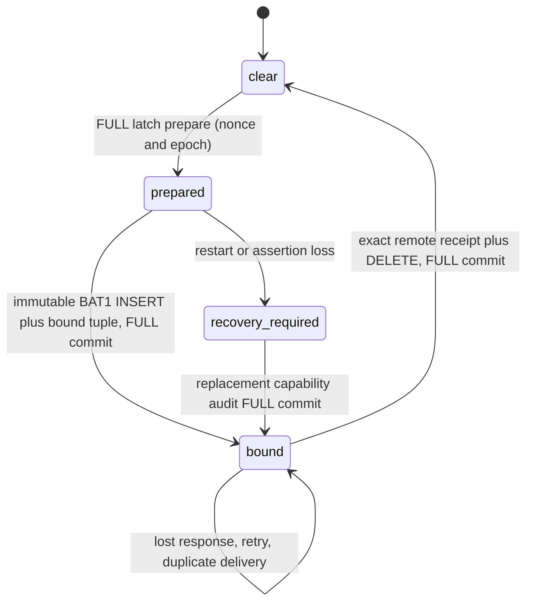
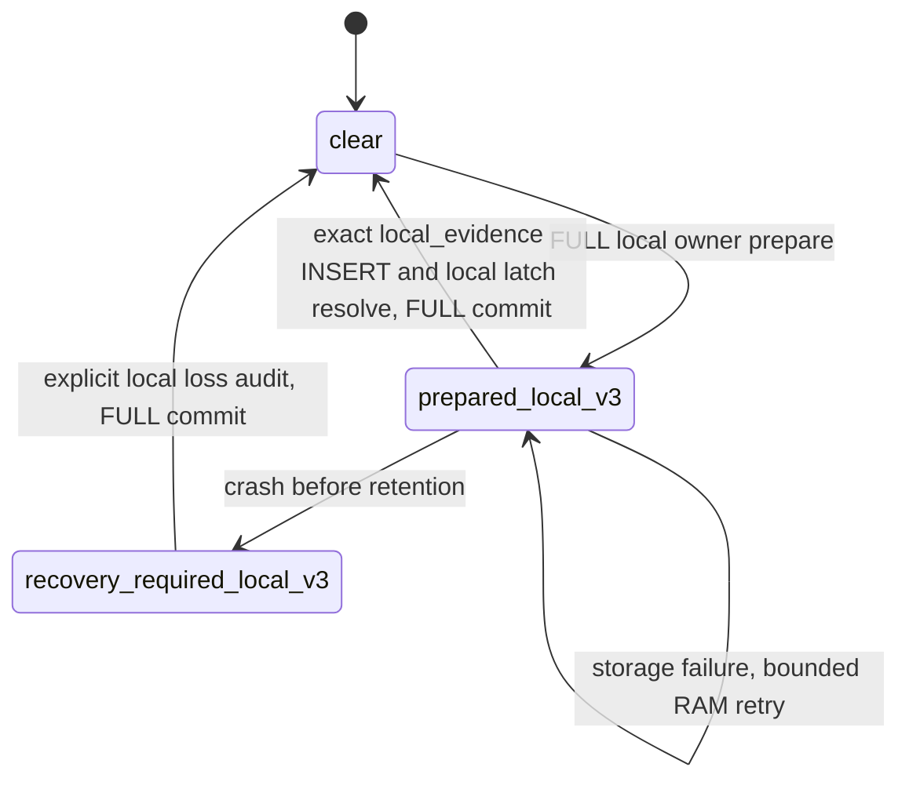

# Source-only ownership and immutable queue compatibility

This document describes development changes and isolation tests. It does not
approve production deployment or authorize migration of any real queue.

## Existing remote-v2 state transitions

The event batch owner seals its BAT1/BATZ bytes and batch ID before handoff.
SQLite owns those exact bytes after successful insertion. Replay does not rebuild
them. Delivery failures use durable exponential retry deadlines capped at 300
seconds; transport budget refusal consumes no retry allowance. A successful
remote receipt binds version 1, endpoint ID, batch ID, and SHA256 of the complete
header plus payload. SQLite deletes only the exact selected pending row in the
same open database generation. A source-only remote-v2 latch clears in the same
FULL transaction. No queue-empty check or local insert substitutes for receipt.

The detection owner observes the cleared latch, verifies authenticated IR and a
FULL storage probe, and checks retained retry ownership before reopening its
capability. A loss or unavailable owner keeps the affected event family visibly
unhealthy. The eight-slot RAM handoff does not overwrite pending assertions.
Matched alerts waiting for safe action/delivery remain in the existing durable
`p0_deferred_match` journal; minimization does not reduce collection or matching.

## New local-v3 ownership

The source-only semantic evidence codec remains `p0-source-only-v2`. It is retained
locally unchanged. Its **delivery owner** is explicitly version 3 in queue meta;
this is not a new server protocol. The current source-only producer uses
`edr_storage_queue_p0_source_only_latch_prepare_local` and
`edr_storage_queue_p0_source_only_commit_local`.

The local-v3 transaction stores the entire immutable full diagnostic wire with
status `local_evidence` and reason `source_only_local_v3`. It resolves only an
exact local-v3 nonce/counter/epoch. Its success means `LOCAL_DURABLE`; it never
increments remote sent, received or acknowledged counters. The full record has
no transmit selector. Health reports consume numeric owner/retention/failure
metrics through a separate explicit whitelist; a raw source event is not renamed
health. Local durability recovery still requires healthy authenticated IR, no
pending retry owner and the existing FULL probe. Retaining another source cannot
erase an overflow loss: an explicit local loss audit must be committed first.

Local wires and held wires count toward the configured queue logical byte limit.
They are not automatically deleted or evicted to make room. Capacity exhaustion
returns explicit backpressure and activates existing observable family recovery
handling. Physical WAL/SHM size remains a diagnostic, not admission authority.
Local retention does not have an unbounded separate outbox or worker. A configured
zero limit now uses the finite 512 MiB default; a zero, invalid or out-of-range
environment override falls back to the finite configured limit and reports
`capacity_limit_defaulted` with a cause in the diagnostic log. The agent's current
default and Windows production/compact profiles set 512 MiB; the events-only
example sets 256 MiB. Reducing a limit below existing retained bytes leaves all
immutable bodies present and rejects new admissions with explicit backpressure.
The limit covers retained logical bytes, not an enforced physical disk ceiling.

## Historical compatibility and release blockers

The only schema extension records owner version; historical entries default to
remote-v2. It does not modify payloads, batch IDs, compression or existing ACK
semantics. This schema code was exercised only against disposable test databases
in this task. No actual endpoint queue was opened or migrated.

Missing singleton metadata is not confirmation of its former owner. Opening
inventories all retained severity-2 wires, including `policy_held` and `corrupt`.
Old or unknown ownership creates a new remote-v2 recovery-required tuple;
strictly identified `local_evidence` / `source_only_local_v3` rows create a
local-v3 loss-audit requirement. An inventory read failure refuses open. The
new missing-meta regression failed before the repair and the full SQLite suite
passed after it. Original bodies and delivery/ACK counters remain unchanged.

Every pending historical event batch is inspected immediately before transport.
A denied batch becomes `policy_held` with its original bytes and ID plus a bounded
reason. All frames are retained together, including valid alerts in a mixed batch.
Neither a projected body under its old ID nor an invented receipt is permitted.
Unknown encoding/magic is retained as dead-letter. Ordinary expiry and exhausted
retries now retain their original body as dead-letter rather than delete it.
Retention remains applicable to payload-free completed dedup tombstones.

An active historical remote-v2 latch cannot be converted or resolved by local-v3.
It reports `source_only_legacy_ack_compatibility_pending`; local storage probes
and health-summary receipts cannot clear it. This is an explicit compatibility
blocker for upgrading affected endpoints. This implementation alone cannot claim
successful old-queue migration, automatic unblocking of old bound detection
capability, or complete delivery of valid alerts in mixed legacy batches.

PMFE clean or inconclusive follow-ups also need a compatible association owner.
`followup_only=true` and a `source_alert_id` string do not prove that a concrete
original alert exists or belongs to the same endpoint and process generation.
The standalone egress guard therefore denies those assertions and retains queued
wires locally. This can withhold context that would explain a genuine alert;
it is an explicit completeness blocker. A versioned durable association must
bind the original alert identity, endpoint, process generation, follow-up reason
and lifecycle before allowing that context. Existing held bodies must retain
their own ID and hash; any new permitted projection needs its own receipt.

A production migration requires a separately reviewed server contract:

1. Negotiate an owner/version capability and explicit `LOCAL_DURABLE` versus
   `REMOTE_ACK` states. A health summary has its own new batch identity and ACK.
2. Retain immutable original bodies locally, bind any new permitted projection
   to its original body hash, new ID and projection version, and record both
   owners. A summary receipt must never ACK the original payload.
3. For mixed bodies, extract only verified alert frames under a new ID in an
   atomic local handoff with dedup linkage; validate receive and ACK state for
   that new body. Original entries remain held pending approved disposition.
4. Restore historical detection capability only through an explicit compatible
   ownership transition, preserving authenticated IR, loss audit and retry
   invariants. Restart, crash, duplicate projection and lost ACK must be tested.
5. Provide a bounded operator recovery/export/disposition workflow. No current
   task may delete retained evidence, edit original payloads or enable old raw
   transmission to make a capacity or health test pass.

There is no automatic mixed-batch projection or operator release API in this
change. Held state and capacity are durable, but these recovery workflows remain
release blockers. The independent enforcement terminal journal is guarded again
at HTTP transport; policy denial does not forge its action or ACK state. Its
replay owner still treats that denial as a transport failure: the selected intent,
source or combined frame retains its exact bytes and batch ID, increments its
retry count, and follows the existing backoff capped at 300 seconds. It has no
durable per-frame `policy_held` status. A failed journal frame ends that journal
drain pass, while the ordinary queue drain can continue. Because selection visits
source before combined frames and their due time shares journal retry metadata,
denied source frames can delay valid combined-alert delivery. This is an explicit
delivery/recovery limitation, not proof that valid terminal alerts are delivered.
Per-frame recovery needs review; failing or deleting an entire action journal
would hide its valid combined alert and falsify the enforcement audit owner.

## Reproducible verification and evidence boundaries

`test_storage_queue_sqlite` calls the production storage owner with disposable
SQLite files. Its semantic validator stub isolates state transitions; it is not
proof of correct protobuf admission or HTTP receipt. Added cases verify failed
FULL commit rollback, exact local-v3 retention, no transport/ACK increments,
restart, crash-gap local loss audit, refusal to convert old remote-v2, and durable
policy hold preserving bytes and retry count. Existing cases cover ACK loss,
replay, corruption, backpressure, journal ownership and open-generation races.
The finite-limit cases cover zero/invalid settings, a valid explicit override,
and reopening a queue whose unchanged retained evidence exceeds a lowered limit.

`test_p0_direct_emit_suppression` calls the production source/detection owner and
isolates persistence. It verifies local-v3 retry, overflow loss audit and IR gates.
`bash tests/run_p0_source_only_real_ir.sh` builds the existing durable fixture
with the actual production IR matcher and system PCRE2/OpenSSL **TEST ONLY**,
without changing CMake release provenance. It runs the current 180-rule plaintext
bundle and an AES-GCM EDR1 envelope produced by the test-only encryption helper,
and requires authentication failure (-3) for a tampered tag. Persistence still
uses the fixture capture stub. This proves the real matcher/codec and authenticated
envelope, not a publisher signature, signed remote delivery, SQLite or HTTP.
The full compiler command and source list are kept in that runner. Custom
system-library locations use `EDR_TEST_PCRE2_PREFIX` and `EDR_TEST_OPENSSL_PREFIX`.

The separate real codec and isolated HTTPS tests are required to establish fewer
actual request bytes without missing valid alert/context; passing storage and
owner tests alone is not that evidence. Windows native collector/enrollment,
production backend negotiation, genuine process crash and real queue migration
remain unexecuted unless explicitly recorded by a later approved validation.
