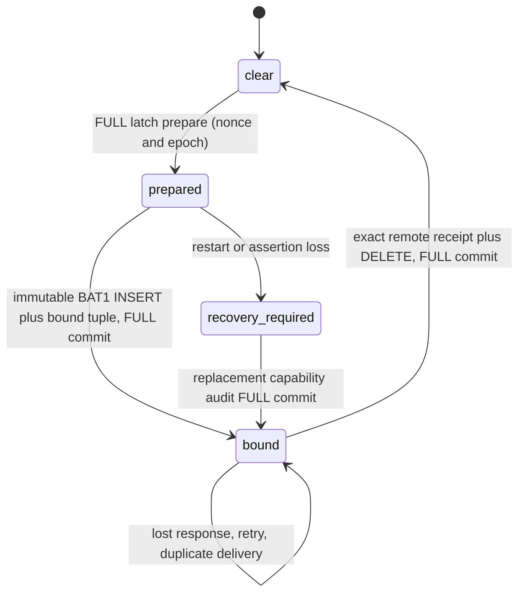
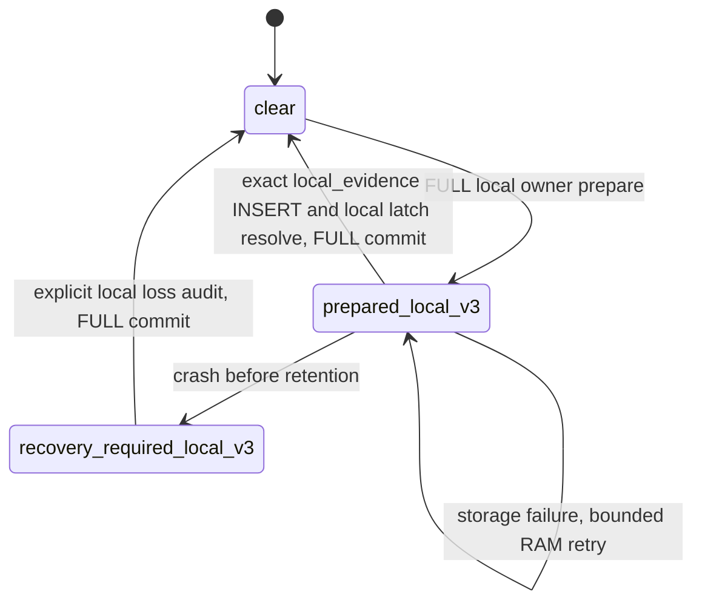

# Source-only ownership and immutable queue compatibility

This document describes development changes and isolation tests. It does not
approve production deployment or authorize migration of any real queue.

## Existing remote-v2 state transitions



The event batch owner seals its BAT1/BATZ bytes and batch ID before handoff.
SQLite owns those exact bytes after successful insertion. Replay does not rebuild
them. Delivery failures use durable exponential retry deadlines capped at 300
seconds; transport budget refusal consumes no retry allowance. A successful
remote receipt binds version 1, endpoint ID, batch ID, and SHA256 of the complete
header plus payload. SQLite deletes only the exact selected pending row in the
same open database generation. A source-only remote-v2 latch clears in the same
FULL transaction. No queue-empty check or local insert substitutes for receipt.

The detection owner observes the cleared latch, verifies authenticated IR and a
FULL storage probe, and checks retained retry ownership before reopening its
capability. A loss or unavailable owner keeps the affected event family visibly
unhealthy. The eight-slot RAM handoff does not overwrite pending assertions.
Matched alerts waiting for safe action/delivery remain in the existing durable
`p0_deferred_match` journal; minimization does not reduce collection or matching.

## New local-v3 ownership

The source-only semantic evidence codec remains `p0-source-only-v2`. It is retained
locally unchanged. Its **delivery owner** is explicitly version 3 in queue meta;
this is not a new server protocol. The current source-only producer uses
`edr_storage_queue_p0_source_only_latch_prepare_local` and
`edr_storage_queue_p0_source_only_commit_local`.



The local-v3 transaction stores the entire immutable full diagnostic wire with
status `local_evidence` and reason `source_only_local_v3`. It resolves only an
exact local-v3 nonce/counter/epoch. Its success means `LOCAL_DURABLE`; it never
increments remote sent, received or acknowledged counters. The full record has
no transmit selector. Health reports consume numeric owner/retention/failure
metrics through a separate explicit whitelist; a raw source event is not renamed
health. Local durability recovery still requires healthy authenticated IR, no
pending retry owner and the existing FULL probe. Retaining another source cannot
erase an overflow loss: an explicit local loss audit must be committed first.

Local wires and held wires count toward the configured queue logical byte limit.
They are not automatically deleted or evicted to make room. Capacity exhaustion
returns explicit backpressure and activates existing observable family recovery
handling. Physical WAL/SHM size remains a diagnostic, not admission authority.
Local retention does not have an unbounded separate outbox or worker. A configured
zero limit now uses the finite 512 MiB default; a zero, invalid or out-of-range
environment override falls back to the finite configured limit and reports
`capacity_limit_defaulted` with a cause in the diagnostic log. The agent's current
default and Windows production/compact profiles set 512 MiB; the events-only
example sets 256 MiB. Reducing a limit below existing retained bytes leaves all
immutable bodies present and rejects new admissions with explicit backpressure.
The limit covers retained logical bytes, not an enforced physical disk ceiling.

## Historical compatibility and release blockers

The only schema extension records owner version; historical entries default to
remote-v2. It does not modify payloads, batch IDs, compression or existing ACK
semantics. This schema code was exercised only against disposable test databases
in this task. No actual endpoint queue was opened or migrated.

Missing singleton metadata is not confirmation of its former owner. Opening
inventories all retained severity-2 wires, including `policy_held` and `corrupt`.
Old or unknown ownership creates a new remote-v2 recovery-required tuple;
strictly identified `local_evidence` / `source_only_local_v3` rows create a
local-v3 loss-audit requirement. An inventory read failure refuses open. The
new missing-meta regression failed before the repair and the full SQLite suite
passed after it. Original bodies and delivery/ACK counters remain unchanged.

Every pending historical event batch is inspected immediately before transport.
A denied batch becomes `policy_held` with its original bytes and ID plus a bounded
reason. All frames are retained together, including valid alerts in a mixed batch.
Neither a projected body under its old ID nor an invented receipt is permitted.
Unknown encoding/magic is retained as dead-letter. Ordinary expiry and exhausted
retries now retain their original body as dead-letter rather than delete it.
Retention remains applicable to payload-free completed dedup tombstones.

An active historical remote-v2 latch is never implicitly converted or cleared by
new local-v3 source retention. Normal operation reports
`source_only_legacy_ack_compatibility_pending`. The explicit offline recovery
consumer below can transfer **current delivery ownership** while preserving the
old remote owner as unacknowledged. Neither a probe nor a health-summary receipt
acknowledges the old tuple or original payload.

## Explicit offline recovery version 1

The production consumer is `--queue-recover-v1`, reached in `main` before service,
collector, agent initialization or HTTP startup. It reads local configuration via
`edr_config_load` to obtain the configured tenant/endpoint and finite queue cap.
Configuration and queue paths must be absolute. The agent must be stopped; both
check and apply acquire the existing exclusive queue lock, with bounded lock
wait and SQLite busy timeout. Tests execute only disposable synthetic databases.

Default **check** opens the existing database with `SQLITE_OPEN_READONLY` and a
consistent read transaction. It does not call ordinary queue open, create schema,
update session/latch state, purge evidence, start HTTP, or send bytes. The lock
file may be created if absent; it is the existing synchronization mechanism, not
a new evidence or ACK owner. Output is limited to version, numeric counts/states,
nonce/counter/epoch, snapshot SHA256 and a bounded reason. Raw events, paths,
original batch/event identities, commands and credentials are not printed.

Example check (all paths here are placeholders for an isolated fixture):

```sh
edr_agent --queue-recover-v1 --config /absolute/synthetic/agent.toml \
  --queue /absolute/synthetic/queue.db --limit 32 --after-row-id 0
```

**Apply** requires explicit target owner 3, the exact current owner tuple and the
check's inventory SHA. The SHA binds scope, projector version, cursor/limit,
original immutable row identity/status/hash, bound wire hash, existing lineage,
and the actual admission/projection outcome. A foreign known scope rejects the
whole operation. A changed inventory/proof rejects stale authorization. The
bound old batch is inspected first even if its row precedes the requested cursor.

```sh
edr_agent --queue-recover-v1 --config /absolute/synthetic/agent.toml \
  --queue /absolute/synthetic/queue.db --limit 32 --after-row-id 0 \
  --apply --target-owner-version 3 --expected-owner-version 2 \
  --expected-queue-nonce HEX32 --expected-counter COUNTER --expected-epoch EPOCH \
  --expected-inventory-sha256 HEX64
```

Check and apply must use the same scope, cursor and limit. A pass selects at most
32 original batches/journal frames and 128 MiB of original bytes. The numeric
`last_event_row_id` is the cursor for a subsequent fresh check. Retained unresolved
rows can be rechecked from cursor zero after a supported decoder/proof upgrade;
advancing the cursor prevents unchanged unsupported early rows starving later
inventory. A stored original SHA mismatch refuses recheck without replacing the
hash. Retry of the latest committed snapshot/authorizing tuple is idempotent.

Apply takes one `BEGIN IMMEDIATE` writer transaction before reading the inventory,
uses `synchronous=FULL`, and commits the following together:

1. One bounded `queue_meta.legacy_lineage` preserves the old remote-v2 nonce,
   counter/epoch, state, event/batch binding and original full-wire SHA (or an
   explicit unavailable marker), plus transition version and operator scope.
   It always remains `unacknowledged=true`. A second different legacy owner
   cannot overwrite it. Unknown scope is retained as unknown, not certified by
   the operator's configured scope.
2. Original event rows retain the exact batch ID and full payload. Their own
   hash, recovery version, `alert-fields-v1` projector version and any new
   projection link are stored. Known ordinary rows become `local_only`;
   unsupported/corrupt/unknown versions become `retained_unresolved`.
3. Entire decoded bodies are scope checked. Verified eligible frames are copied
   exactly; understood legacy alerts may use the same typed producer projector
   under version `alert-fields-v1`. Any admitted result gets a **new** deterministic
   batch ID, canonical BAT1 body, and separate pending row. Original bytes are
   never replaced under their old batch ID.
4. The active owner becomes local-v3 `recovery_required` with a new epoch. This
   does not clear a fuse or manufacture a receipt. The existing P0 owner must
   still preserve a new local loss audit, verify authenticated healthy IR, prove
   FULL storage and resolve bounded retry ownership before restoring detection.

The existing server v1 receipt is sufficient for the new projection: endpoint,
new batch ID and complete new payload SHA bind `durable` or `processed` receipt.
`report_events_ack.go` and the ingest consumer already distinguish invalid frames
and complete-batch acceptance. No new production protocol or ACK exception is
introduced. A true new receipt atomically deletes only its pending projection and
updates the immutable original's `projection_pending` to `projection_acked` under
FULL durability. Linked permitted alert projections retain capped service-lifetime
retry across ordinary max-retry/TTL thresholds. Policy-held linked projections can
be explicitly rechecked by this same maintenance consumer and resumed under their
exact existing new ID/body/hash; their original source hash/link is verified and
retry history is preserved. No second projection or original ACK is manufactured. The archived old remote owner remains unacknowledged. A missing,
wrong, lost or replayed receipt cannot acknowledge the original body.

Logical capacity includes every original/projection row, one 2 KiB legacy lineage,
one 2 KiB bounded latest authorization, and 512 bytes of recovery metadata per
recovered row. Rechecks do not charge that row overhead twice. Capacity refusal
rolls the entire transaction back and preserves rows/owner. No purge or eviction
occurs; operators may adjust the existing finite configured cap and perform a new
check. Unreadable/corrupt ownership metadata needs verified repair/backup, not a
fabricated owner or ACK. There is no automatic original-row projection or owner
transition on startup. Additive restart-safe metadata columns support the current
runtime consumers, without rewriting an existing original payload.

## Independent enforcement terminal frames

Intent, source and combined frames each retain their own immutable ID/body,
receipt flag, policy reason, hold flag, retry counter and durable deadline.
Send-time policy rejection commits only that frame's `policy_held`; it does not
increment transport retries or end the drain pass. A forbidden raw source cannot
starve an eligible combined alert. Transport failures use independent capped
backoff. Actual journal ACK updates now use FULL transactions as well.

The current backend does not materialize a paired P0 alert from the combined
frame alone. The exact original intent is required association context. Both intent and
combined are permitted only by the existing journal owner: an independent read-only SQLite connection
checks the current queue nonce, committed row/key/rule/source/generation, exact
original intent/combined bytes/SHA, and intrinsic same-tuple schema/provenance
checks for both frames (these pure checks never recurse into the owner callback). The shared
parser checks terminal commitment, scope, bundle, canonical path and file identity.
The callback never acquires the already-held queue mutex; its separate lifetime
lock and bounded 100 ms busy timeout protect shutdown/reopen. Missing or unknown
outcomes stay denied. A bounded rotating service drain rechecks previously held
intents automatically after a genuine combined frame commits, preserving the old
batch ID/body. A FULL failure preserves the held state. A confirmed exact journal
receipt may remove its exact ordinary held copy in the same FULL transaction;
legacy source owners and recovery-lineage rows keep their distinct ownership.

A historical `completed` or `local_retained` label does not substitute for the
intent receipt. If `intent_acked=0`, the existing immutable intent alone is
replayed through the same exact pair guard, still counted as pending until its
independent real receipt commits. This does not change the old action state,
body, ID, source receipt or combined receipt, and never reruns enforcement. TTL
retains those records; absent/corrupt provenance remains held with an observable
cause. Wrong ACK or FULL ACK-commit failure retains the pending context across
restart. Isolated regressions exercise both historical states.

Historical paired combined/mixed batches without a complete matching journal
produce no projection: they are retained as `retained_unresolved`. After a
complete original owner becomes available, the existing bounded explicit CLI
recheck can authorize a new independently acknowledged projection; the journal
also replays its original required intent. HTTP acceptance of a lone combined
frame is never treated as successful logical alert migration.

A known `ready` final outcome with source held/ACK 0 and **separate real intent
and combined receipts** enters `local_retained`. This explicitly means local
source retention plus remote intent/combined confirmation; it is not remote source ACK or an unknown action outcome.
All wires/action identities/hashes remain retained and counted in finite capacity,
and TTL cannot purge this state. It releases the 1,024 pending-action slot gate so
an accumulated retained history does not permanently stop new actions. Exhausting
total logical capacity still denies pre-action admission visibly. An
`outcome_unknown` action never qualifies for this transition or re-execution.

The same offline consumer scope/purpose checks held frames. An exact original
frame whose current purpose/proof becomes eligible can return from
`local_retained` to `ready`, without editing its ID/body or setting ACK. A still
forbidden source remains held. Existing action idempotency is preserved throughout.
Health exposes `policy_held_frames` and `local_retained`, in addition to queue
lineage/unresolved/projection counters. No healthy status comes from renaming raw
source data as health.

PMFE clean/inconclusive follow-up association and lifecycle are owned by the
durable evidence cache, not by an ID string. The egress callback requires the
exact original alert/scope/generation and bound result bytes. Its result receipt
is independent, and final cache completion follows real queue FULL removal;
closed/read-failed/conflicting queue lookups preserve the pinned result. Historical
unknown bodies lacking that proof remain local until explicit supported recovery.

## Reproducible verification and evidence boundaries

`test_storage_queue_sqlite` calls the production storage owner with disposable
SQLite files. Its semantic validator stub isolates state transitions; it is not
proof of correct protobuf admission or HTTP receipt. Added cases verify failed
FULL commit rollback, exact local-v3 retention, no transport/ACK increments,
restart, crash-gap local loss audit, refusal to convert old remote-v2, and durable
policy hold preserving bytes and retry count. Existing cases cover ACK loss,
replay, corruption, backpressure, journal ownership and open-generation races.
The finite-limit cases cover zero/invalid settings, a valid explicit override,
and reopening a queue whose unchanged retained evidence exceeds a lowered limit.

`test_p0_direct_emit_suppression` calls the production source/detection owner and
isolates persistence. It verifies local-v3 retry, overflow loss audit and IR gates.
`bash tests/run_p0_source_only_real_ir.sh` builds the existing durable fixture
with the actual production IR matcher and system PCRE2/OpenSSL **TEST ONLY**,
without changing CMake release provenance. It runs the current 180-rule plaintext
bundle and an AES-GCM EDR1 envelope produced by the test-only encryption helper,
and requires authentication failure (-3) for a tampered tag. Persistence still
uses the fixture capture stub. This proves the real matcher/codec and authenticated
envelope, not a publisher signature, signed remote delivery, SQLite or HTTP.
The full compiler command and source list are kept in that runner. Custom
system-library locations use `EDR_TEST_PCRE2_PREFIX` and `EDR_TEST_OPENSSL_PREFIX`.

The separate real codec and isolated HTTPS tests are required to establish fewer
actual request bytes without missing valid alert/context; passing storage and
owner tests alone is not that evidence. Windows native collector/enrollment
and real queue migration remain unexecuted unless explicitly recorded by a later
approved validation. The local server receipt contract was read in source; these
fixtures do not claim production backend acceptance.

`queue_recovery_real_codec` links the production protobuf schema/parser, LZ4,
egress projector/validator and SQLite owner. Only transport delivery is isolated;
its receipt fixture uses the actual v1 receipt parser. It covers raw/compressed
mixed bodies, immutable required alert context, wrong receipt followed by retry
and independent confirmation, read-only main-file SHA, stale authorization,
unknown/local recheck, foreign-scope refusal, cursor progress, original SHA
corruption refusal, finite capacity and metadata overhead. It verifies linked
projection TTL/max-retry survival with zero false confirmations, foreign-scope
resume refusal and exact-ID/body/hash recovery of a policy-held projection. A 1,024-record retained
history still permits a new action without setting any source ACK.

The crash fixture uses real child processes at prepare-before-commit,
transition-before-commit and after-FULL-commit boundaries. POSIX stops the child
then sends SIGKILL; Windows uses CreateProcess and TerminateProcess from the
fixture-only boundary hook. Reopening checks original bytes, old/new owner,
lineage and independent pending projections. The POSIX fixture passed locally;
Windows execution/cross-compilation status must be taken from the separately
recorded native runner, not inferred from portable success. No fixture stub
replaces storage reads/writes or durable transactions.
